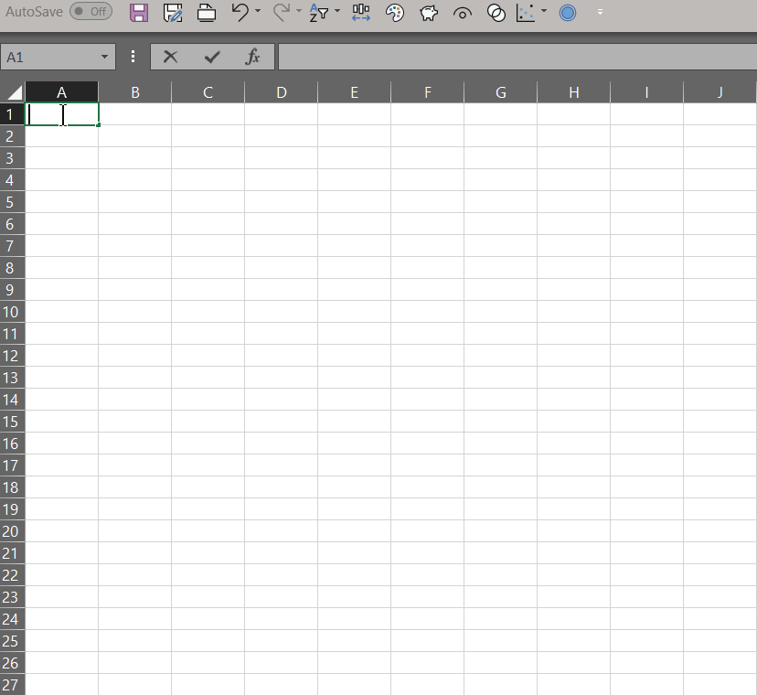

[简体中文](#chs) [繁體中文](#cht) [English](#en)

# <a name="chs">LaTex (tikz)转换为图像</a>

此项目是一个关于把LaTex文档直接转换为各种图像的教程（在编译TEX文件时，同
时生成单独的图像）。此教程主要关注如何把tikz生成的，内嵌于LaTex生成的PDF
文件中的图像转换为各种格式的单独图片。

此项目会讨论到的图片格式如下

* SVG （矢量图）
* PNG （位图）
* EMF （Windows系统上的矢量图）
* EPS （印刷常用格式）

此项目的在于提供基于Windows系统的教程和例子。作者相信Linux用户有能力独自
解决这个问题。

此教程会提供软件安装和配置指南，并会结合例子进行讲解。

此教程认为用户已经对LaTex有一定的理解，因而不会对LaTex中之各种进行详解。


# <a name="cht">LaTex (tikz)轉換爲圖像</a>

四捨六入五留雙是統計學上和金融上常用的一種數值修約方法。它可以保證累計誤
差爲最小。它同時也是IEEE 754推薦的方法。它也稱作“銀行家數值修約法”（不過
因爲裏面的銀行家，即Banker，通常是指做銀行投資業的人，很少指銀行的所有者）。

但是此方法和常用的“四捨五入”法差別較大（主要是邏輯判斷要多一些），而且常
用的表格軟件的默認留位法和它不同，譬如Excel的默認公式（但VBA的默認是），
故此在此作些討論。

[中文維基上的解釋](https://zh.wikipedia.org/wiki/%E6%95%B0%E5%80%BC%E4%BF%AE%E7%BA%A6)
還算比較清楚，但可以簡化如下：

1. 確定保留至 *n* 位數字。
1. 將需要留位的數字乘以 10<sup>n</sup>。
1. 若新數字爲整數，則不需要留位，直接結束。
1. 若新數字不是整數，則判定其小數部分。
    * 若小數部分小於 0.5，則捨位。
    * 若小數部分大於 0.5，則進位。
    * 若小數部分等於 0.5，則需要判斷新數字整數部分的奇偶。
        * 若整數部分爲偶，則捨位。
        * 若整數部分爲奇，則進位。

以上邏輯可由下圖表述：


## 在 Python 中的實現

雖然 Python 3 自帶的“round()”函數所使用的方法就是四捨六入五留雙，由於小
數在計算機中永遠只是近似值，得出的結果還是可能會出問題的。可靠的做法是用
Python 自帶的“decimal”模塊來實現。在此給出一個例子。

```python
from decimal import Decimal, ROUND_HALF_EVEN

def banker_round(fIn, strN)
    '''
    此函數使用“decimal”模塊來實現四捨六入五留雙。

    Parameters
    --------------
    fIn : float
        需要留位的數值。

    strN : str
        留位的格式。

        例：
        “1.00”爲保留兩位小數；“1.000”爲保留三位小數

    Returns
    ----------
    Decimal : Decimal
        按照輸入進行過留位的 Decimal 類型的值。
    '''

    return Decimal(str(fIn)).quantize(Decimal(strN), ROUND_HALF_EVEN)
```

## 在 Excel VBA 中的實現

因爲 Excel VBA 中默認的留位方法就是四捨六入五留雙，用戶可能會認爲只需要
直接調用即可。但是，其實這樣做在引用單元個時還是可能會出錯（直接給數值一
般不會出錯，但 Excel 的強大之處在於單元格的調用，不用就沒意思了）。

在此給出一個 VBA 的公共函數，用戶可以在 Excel 的圖形界面把它當作公式來調
用。

```vb

```

以下是在 Excel 中調用以上函數的錄屏，請注意與 Excel 的默認公式的比較。




# <a name="en">LaTex (tikz) to Images</a>

This project is a tutorial about how to perform converting LaTex
documents directly to images (producing individual images while
compiling TEX files).

This tutorial focuses on how to export the embedded pictures produced by
tikz into individual images of different formats.

This project would discuss the following image formats.

* SVG (vector)
* PNG (bitmap)
* EMF (vector for Windows)
* EPS (commonly used for publishing in print)

This project aims to provide tutorials and examples for Windows. The
author believe that Linux users are more than capable of solving this
issue on their own.

This tutorial would provide guidance for software installations and
configurations. This tutorial would illustrate via examples.

This tutorial assumes that the users already have certain degree of
understanding for LaTex and thus would not discuss LaTex in details.
