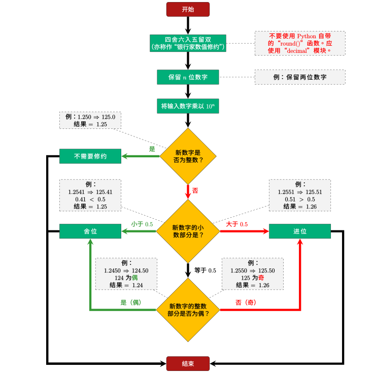
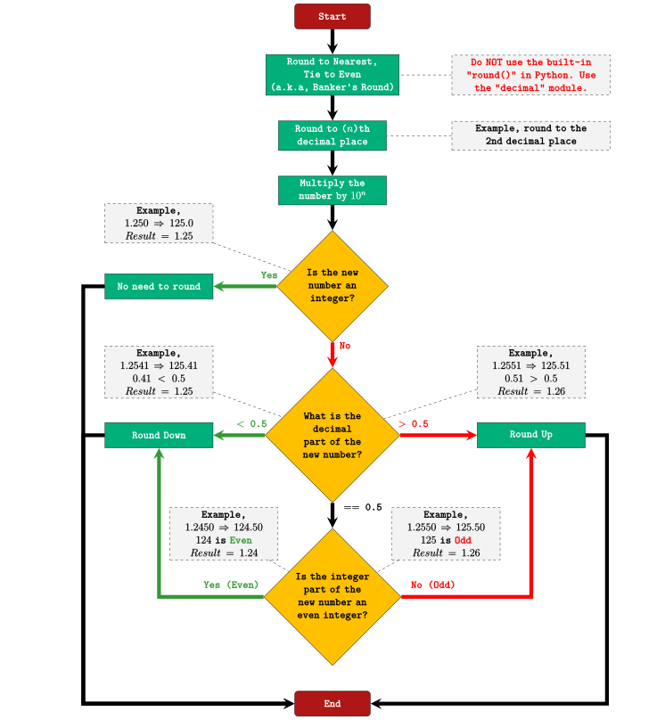

[简体中文](#chs) [繁體中文](#cht) [English](#en)

# <a name="chs">四舍六入五留双（银行家数值修约法）</a>

四舍六入五留双是统计学上和金融上常用的一种数值修约方法。它可以保证累计误
差为最小。它同时也是IEEE 754推荐的方法。它也称作“银行家数值修约法”（不过
英语里面的银行家，即Banker，通常是指做银行投资业的人，很少指银行的所有者）。

但是此方法和常用的“四舍五入”法差别较大（主要是逻辑判断要多一些），而且常
用的表格软件的默认留位法和它不同，譬如Excel的默认公式（但VBA的默认是），
故此在此作些讨论。

[中文维基上的解释](https://zh.wikipedia.org/wiki/%E6%95%B0%E5%80%BC%E4%BF%AE%E7%BA%A6)
还算比较清楚，但可以简化如下：

1. 确定保留至 *n* 位数字。
1. 将需要留位的数字乘以 10<sup>n</sup>。
1. 若新数字为整数，则不需要留位，直接结束。
1. 若新数字不是整数，则判定其小数部分。
    * 若小数部分小于 0.5，则舍位。
    * 若小数部分大于 0.5，则进位。
    * 若小数部分等于 0.5，则需要判断新数字整数部分的奇偶。
        * 若整数部分为偶，则舍位。
        * 若整数部分为奇，则进位。

以上逻辑可由下图表述：



## 在 Python 中的实现

虽然 Python 3 自带的“round()”函数所使用的方法就是四舍六入五留双，由于小
数在计算机中永远只是近似值，得出的结果还是可能会出问题的。可靠的做法是用
Python 自带的“decimal”模块来实现。在此给出一个例子。

```python
from decimal import Decimal, ROUND_HALF_EVEN

def banker_round(fIn, strN):
    '''
    此函数使用“decimal”模块来实现四舍六入五留双。

    Parameters
    --------------
    fIn : float
        需要留位的数值。

    strN : str
        留位的格式。

        例：
        “1.00”为保留两位小数；“1.000”为保留三位小数

    Returns
    ----------
    Decimal : Decimal
        按照输入进行过留位的 Decimal 类型的值。
    '''

    return Decimal(str(fIn)).quantize(Decimal(strN), ROUND_HALF_EVEN)
```

## 在 Excel VBA 中的实现

因为 Excel VBA 中默认的留位方法就是四舍六入五留双，用户可能会认为只需要
直接调用即可。但是，其实这样做在引用单元个时还是可能会出错（直接给数值一
般不会出错，但 Excel 的强大之处在於单元格的调用，不用就没意思了）。

在此给出一个 VBA 的公共函数，用户可以在 Excel 的图形界面把它当作公式来调
用。

```vb
Public Function gsyBankerRound(dblIn As Double, lngN As Long) As Double
'''This function performs Banker's Rounding.
'''
'''Parameters
'''----------
'''dblIn:  double
'''    The number that needs to be rounded.
'''
'''lngN: long
'''    The decimal place to keep.
'''
'''Returns
'''---------
'''Double : Double
'''    The rounded number via Banker's Rounding.

    Dim boolIsEven As Boolean

    ' not greater than half
    Dim boolNGThanHalf As Boolean

    Dim lngExp As Long

    Dim lngTemp As Long

    lngExp = 10 ^ lngN

    lngTemp = 1 * Fix(dblIn * lngExp / 1)

    If (lngTemp Mod 2) = 0 Then

        boolIsEven = True

'        Debug.Print CStr(lngTemp) & " Is Even"

    Else

        boolIsEven = False

        Debug.Print CStr(lngTemp) & " Is Not Even"

    End If

    ' this is equivalent to the MOD formula in the GUI (different from VBA)
    If Application.WorksheetFunction.Round((dblIn * lngExp - (1 * Fix(dblIn * lngExp / 1))), 2) <= 0.5 Then

        boolNGThanHalf = True

    Else

        boolNGThanHalf = False

    End If

    If (boolIsEven = True) And (boolNGThanHalf = True) Then

        gsyBankerRound = Application.WorksheetFunction.RoundDown(dblIn, lngN)

    Else

        ' common round half up
        gsyBankerRound = Application.WorksheetFunction.Round(dblIn, lngN)

    End If

End Function

```

以下是在 Excel 中调用以上函数的录屏，请注意与 Excel 的默认公式的比较。


# <a name="cht">四捨六入五留雙（銀行家數值修約法）</a>

四捨六入五留雙是統計學上和金融上常用的一種數值修約方法。它可以保證累計誤
差爲最小。它同時也是IEEE 754推薦的方法。它也稱作“銀行家數值修約法”（不過
英語裏面的銀行家，即Banker，通常是指做銀行投資業的人，很少指銀行的所有者）。

但是此方法和常用的“四捨五入”法差別較大（主要是邏輯判斷要多一些），而且常
用的表格軟件的默認留位法和它不同，譬如Excel的默認公式（但VBA的默認是），
故此在此作些討論。

[中文維基上的解釋](https://zh.wikipedia.org/wiki/%E6%95%B0%E5%80%BC%E4%BF%AE%E7%BA%A6)
還算比較清楚，但可以簡化如下：

1. 確定保留至 *n* 位數字。
1. 將需要留位的數字乘以 10<sup>n</sup>。
1. 若新數字爲整數，則不需要留位，直接結束。
1. 若新數字不是整數，則判定其小數部分。
    * 若小數部分小於 0.5，則捨位。
    * 若小數部分大於 0.5，則進位。
    * 若小數部分等於 0.5，則需要判斷新數字整數部分的奇偶。
        * 若整數部分爲偶，則捨位。
        * 若整數部分爲奇，則進位。

以上邏輯可由下圖表述：


## 在 Python 中的實現

雖然 Python 3 自帶的“round()”函數所使用的方法就是四捨六入五留雙，由於小
數在計算機中永遠只是近似值，得出的結果還是可能會出問題的。可靠的做法是用
Python 自帶的“decimal”模塊來實現。在此給出一個例子。

```python
from decimal import Decimal, ROUND_HALF_EVEN

def banker_round(fIn, strN):
    '''
    此函數使用“decimal”模塊來實現四捨六入五留雙。

    Parameters
    --------------
    fIn : float
        需要留位的數值。

    strN : str
        留位的格式。

        例：
        “1.00”爲保留兩位小數；“1.000”爲保留三位小數

    Returns
    ----------
    Decimal : Decimal
        按照輸入進行過留位的 Decimal 類型的值。
    '''

    return Decimal(str(fIn)).quantize(Decimal(strN), ROUND_HALF_EVEN)
```

## 在 Excel VBA 中的實現

因爲 Excel VBA 中默認的留位方法就是四捨六入五留雙，用戶可能會認爲只需要
直接調用即可。但是，其實這樣做在引用單元個時還是可能會出錯（直接給數值一
般不會出錯，但 Excel 的強大之處在於單元格的調用，不用就沒意思了）。

在此給出一個 VBA 的公共函數，用戶可以在 Excel 的圖形界面把它當作公式來調
用。

```vb
Public Function gsyBankerRound(dblIn As Double, lngN As Long) As Double
'''This function performs Banker's Rounding.
'''
'''Parameters
'''----------
'''dblIn:  double
'''    The number that needs to be rounded.
'''
'''lngN: long
'''    The decimal place to keep.
'''
'''Returns
'''---------
'''Double : Double
'''    The rounded number via Banker's Rounding.

    Dim boolIsEven As Boolean

    ' not greater than half
    Dim boolNGThanHalf As Boolean

    Dim lngExp As Long

    Dim lngTemp As Long

    lngExp = 10 ^ lngN

    lngTemp = 1 * Fix(dblIn * lngExp / 1)

    If (lngTemp Mod 2) = 0 Then

        boolIsEven = True

'        Debug.Print CStr(lngTemp) & " Is Even"

    Else

        boolIsEven = False

        Debug.Print CStr(lngTemp) & " Is Not Even"

    End If

    ' this is equivalent to the MOD formula in the GUI (different from VBA)
    If Application.WorksheetFunction.Round((dblIn * lngExp - (1 * Fix(dblIn * lngExp / 1))), 2) <= 0.5 Then

        boolNGThanHalf = True

    Else

        boolNGThanHalf = False

    End If

    If (boolIsEven = True) And (boolNGThanHalf = True) Then

        gsyBankerRound = Application.WorksheetFunction.RoundDown(dblIn, lngN)

    Else

        ' common round half up
        gsyBankerRound = Application.WorksheetFunction.Round(dblIn, lngN)

    End If

End Function

```

以下是在 Excel 中調用以上函數的錄屏，請注意與 Excel 的默認公式的比較。


# <a name="en">Round Half to Even (Banker's Rounding)</a>

Round Half to Even is a common rounding method used in statistics and
finance. It can guarantee the minimal cumulative errors. It is also the
method recommend by IEEE 754. It is also know as "Banker's Rounding".

But this method is quite different from the commonly used "Round Half
Up" (more logical conditions). Also, many commonly used spreedsheet
software have different rounding methods. For example, the default
formula of MS Excel (but not the one in Excel VBA). Thus it warrants a
discussion.

[Wikipedia](https://en.wikipedia.org/wiki/Rounding) offers some
explanations, but they can be summarised as the following.

1. Round to (*n*)th decimal place
1. Multipy the number by 10<sup>n</sup>。
1. If the new number is an integer, then no rounding need. End directly.
1. If the new number is not an integer, then its decimal part needs to
   be judged.
    * If the decimal part is smaller than 0.5, round down.
    * If the decimal part is larger than 0.5, round up.
    * If the decimal part is equal to 0.5, then needs to judge the
      integer part of the new number.
        * If the integer part is even, round down.
        * If the integer part is odd, round up.

The logic can be illustrated as the following figure.



## Implementation in Python

Though the built-in "round()" function is Round Half to Even, due to the
fact that a decimal number can never be exactly represented in
computers, the result could still be wrong. The most robust method is to
use the "decimal" module shipped with Python to implement it.

The following is an example.

```python
from decimal import Decimal, ROUND_HALF_EVEN

def banker_round(fIn, strN):
    '''
    This function uses the “decimal” to implement Banker's Rounding.

    Parameters
    --------------
    fIn : float
        The number that needs to be rounded.

    strN : str
        The format for rounding.

        Example:
        "1.00" is for rounded to 2nd decimal places; "1.000" is for rounded to 3rd decimal places.

    Returns
    ----------
    Decimal : Decimal
        Rounded value as a Decimal object.
    '''

    return Decimal(str(fIn)).quantize(Decimal(strN), ROUND_HALF_EVEN)
```

## Implementation in Excel VBA

Due to the fact that the default "Round()" function in Excel VBA use
Round Half to Even, users may think that they could just call this
function in the Excel GUI. This could still be problematic when cell
values are used as references (usually the results would be correct if
the cell values are given directly instead of the referencing the cell
addresses, but this would be too impractical. Excel's power lies in
referencing cell address).

Here is a public function in Excel VBA. The users can call it as a
formula in Excel VBA.

```vb
Public Function gsyBankerRound(dblIn As Double, lngN As Long) As Double
'''This function performs Banker's Rounding.
'''
'''Parameters
'''----------
'''dblIn:  double
'''    The number that needs to be rounded.
'''
'''lngN: long
'''    The decimal place to keep.
'''
'''Returns
'''---------
'''Double : Double
'''    The rounded number via Banker's Rounding.

    Dim boolIsEven As Boolean

    ' not greater than half
    Dim boolNGThanHalf As Boolean

    Dim lngExp As Long

    Dim lngTemp As Long

    lngExp = 10 ^ lngN

    lngTemp = 1 * Fix(dblIn * lngExp / 1)

    If (lngTemp Mod 2) = 0 Then

        boolIsEven = True

'        Debug.Print CStr(lngTemp) & " Is Even"

    Else

        boolIsEven = False

        Debug.Print CStr(lngTemp) & " Is Not Even"

    End If

    ' this is equivalent to the MOD formula in the GUI (different from VBA)
    If Application.WorksheetFunction.Round((dblIn * lngExp - (1 * Fix(dblIn * lngExp / 1))), 2) <= 0.5 Then

        boolNGThanHalf = True

    Else

        boolNGThanHalf = False

    End If

    If (boolIsEven = True) And (boolNGThanHalf = True) Then

        gsyBankerRound = Application.WorksheetFunction.RoundDown(dblIn, lngN)

    Else

        ' common round half up
        gsyBankerRound = Application.WorksheetFunction.Round(dblIn, lngN)

    End If

End Function

```

The follwing is a screen recording of call the function above. Note the
difference with the default Excel formula.


